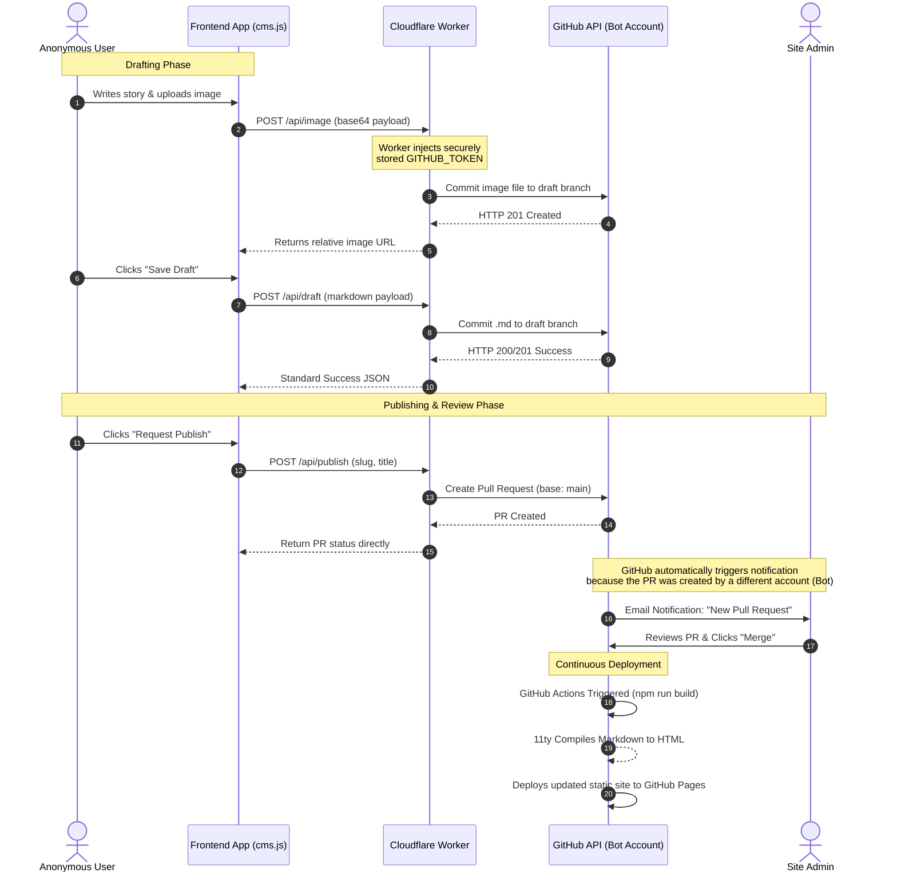

# Anonymous CMS Submission Architecture

This document outlines the technical workflow for the anonymous content management system (CMS). For details on the underlying infrastructure, hosting, and deployment, see the [Deployment & Infrastructure Guide](deployment.md).

## Sequence Diagram

The following Mermaid sequence diagram visualizes the flow of data between the anonymous user, the frontend application (`cms.js`), the securely hosted Cloudflare Worker, the GitHub Repository, and the Site Administrator.

## Component Breakdown

### 1. Frontend App (`cms.js`)
The javascript running in the user's browser acts as a simple HTTP client. Instead of interacting with the `octokit` library directly and requiring a GitHub Personal Access Token, it executes standard `fetch` requests (GET, POST, DELETE) pointing to the Cloudflare Worker URL.

### 2. Cloudflare Worker (The Security Proxy)
The serverless Cloudflare Worker sits between the frontend and GitHub. It holds the `GITHUB_TOKEN` securely in its encrypted environment variables. Its sole purpose is to receive verified API requests from the frontend, inject the GitHub authentication headers, and execute the commits using the `@octokit/rest` library on behalf of the user.

### 3. GitHub Bot Account
The Cloudflare Worker uses an explicit automation "Bot Account" to interface with GitHub. Because the commits and pull requests are originating from this separate account, it allows GitHub's native notification system to correctly ping the actual Site Admin (the owner of the repository) whenever a new Pull Request is opened.

### 4. Continuous Deployment
Once the Site Admin reviews the PR and hits "Merge", the pre-existing GitHub Actions pipeline automatically triggers, running Eleventy (`11ty`) to compile the site and push the new files to the live GitHub Pages environment.

---
*For administrative instructions on updating the Cloudflare Worker or migrating the bot account, see the [Deployment & Infrastructure Guide](deployment.md).*
